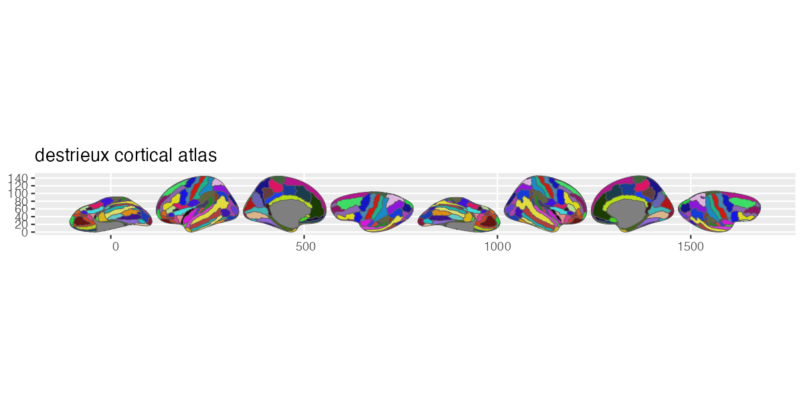

# ggsegDestrieux

Destrieux Atlas for the ggsegverse Ecosystem.

## Installation

``` r
# install.packages("remotes")
remotes::install_github("ggsegverse/ggsegDestrieux")
```

## Usage

``` r
library(ggsegDestrieux)
library(ggseg)

plot(destrieux()) +
  theme_brain()
```

## Atlas

### destrieux

Destrieux cortical parcellation (aparc.a2009s) with 75 regions per hemisphere (Destrieux et al., 2010).


