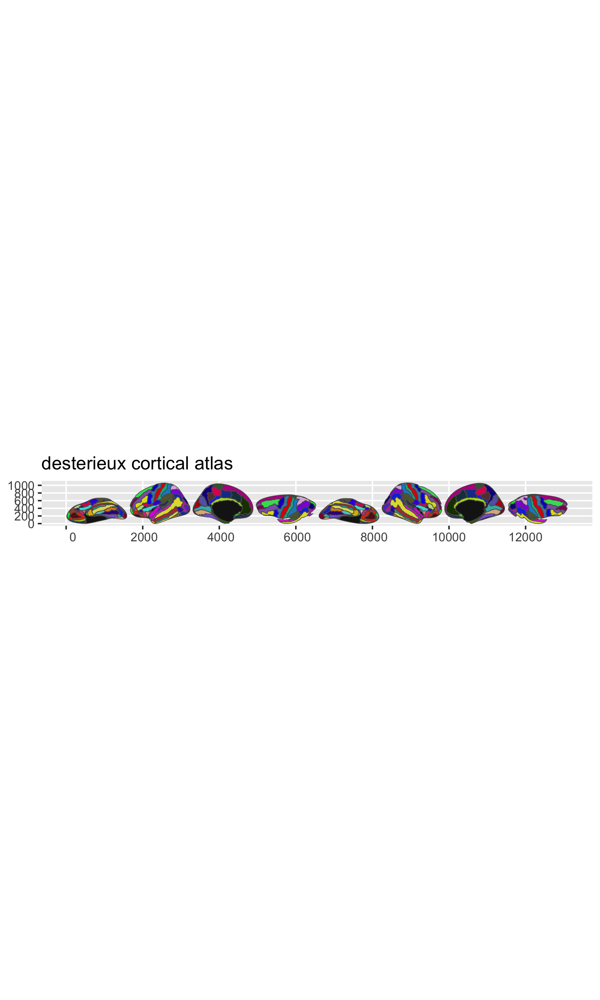
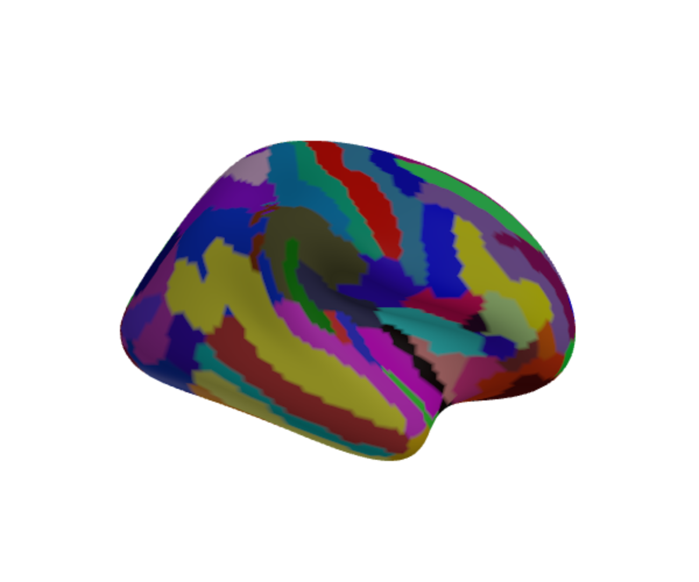

# ggsegdestrieux

This package contains dataset for plotting the destrieux cortical atlas
ggseg and ggseg3d.

destrieux, Fischl, Dale,& Halgren (2010) Neuroimage. 53(1): 1–15. doi:
[0.1016/j.neuroimage.2010.06.010](https://www.ncbi.nlm.nih.gov/pmc/articles/PMC2937159/)

## Installation

We recommend installing the ggseg-atlases through the ggsegverse
[r-universe](https://ggseg.r-universe.dev/ui#builds):

``` r
# Enable this universe
options(
  repos = c(
    ggsegverse = 'https://ggseg.r-universe.dev',
    CRAN = 'https://cloud.r-project.org'
  )
)

# Install some packages
install.packages('ggsegDestrieux')
```

You can install the released version version from
[GitHub](https://github.com/) with:

``` r
# install.packages("remotes")
remotes::install_github("ggsegverse/ggsegDestrieux")
```

## Example

This is a basic example which shows you how to solve a common problem:

``` r
library(ggsegDestrieux)
```

``` r
library(ggseg)
library(ggplot2)

plot(destrieux()) +
  theme(legend.position = "bottom", legend.text = element_text(size = 7)) +
  guides(fill = guide_legend(ncol = 3))
```



``` r
library(ggseg3d)
library(dplyr)

ggseg3d(atlas = destrieux()) |>
  pan_camera("right lateral")
```



Please note that the ‘ggsegdestrieux’ project is released with a
[Contributor Code of
Conduct](https://ggsegverse.github.io/ggsegdestrieux/CODE_OF_CONDUCT.md).
By contributing to this project, you agree to abide by its terms.
